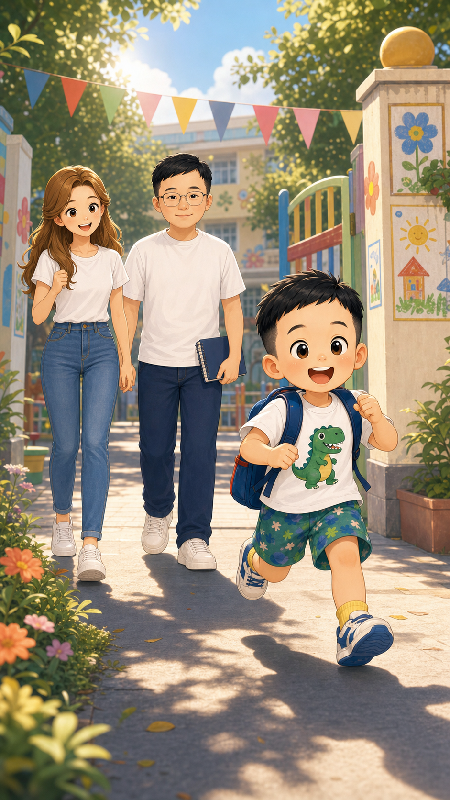
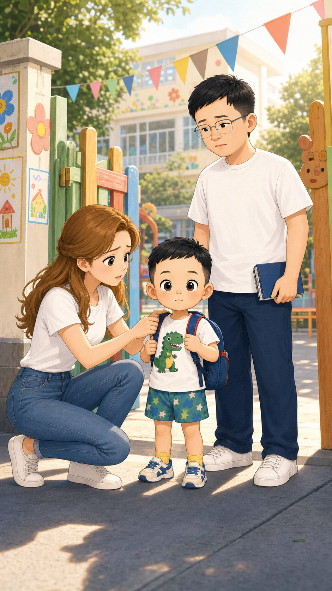
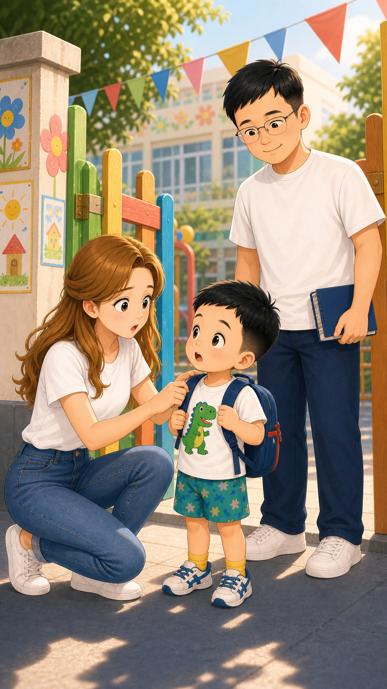
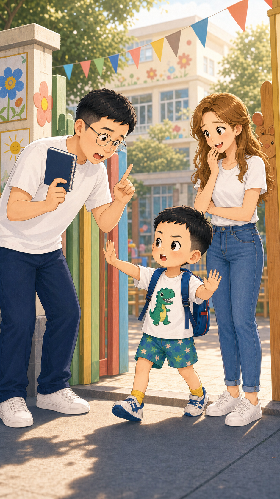
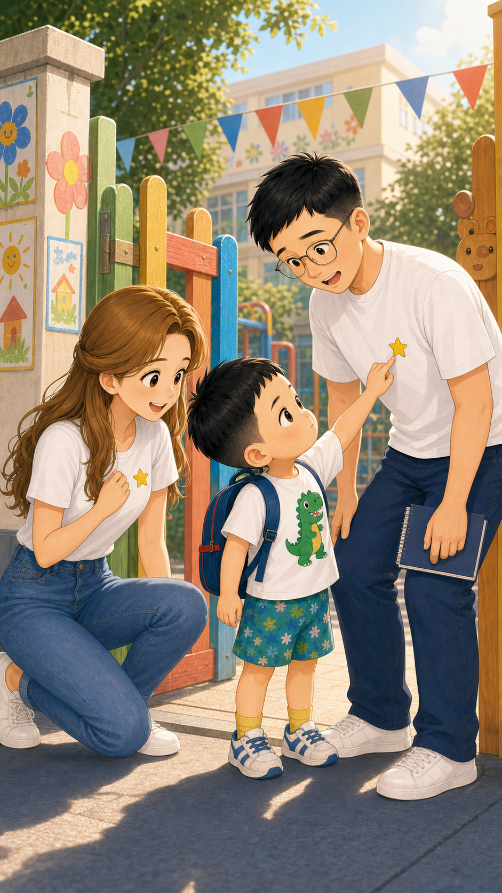
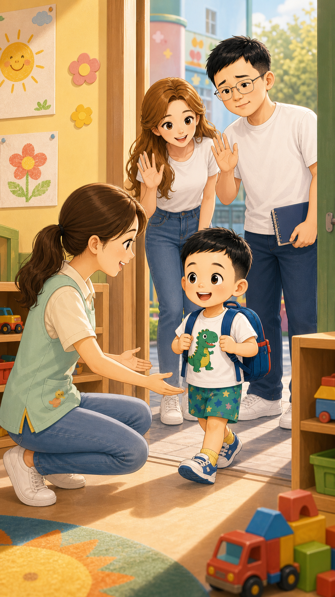
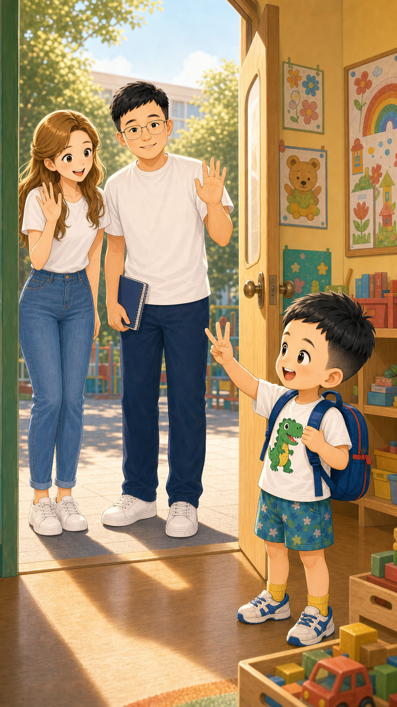
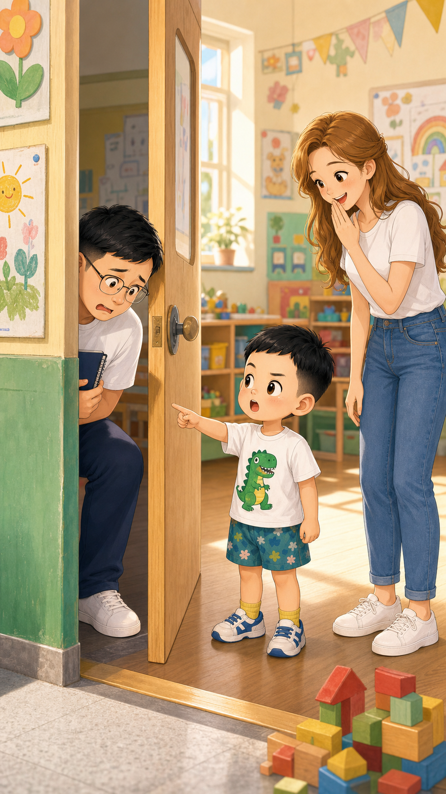
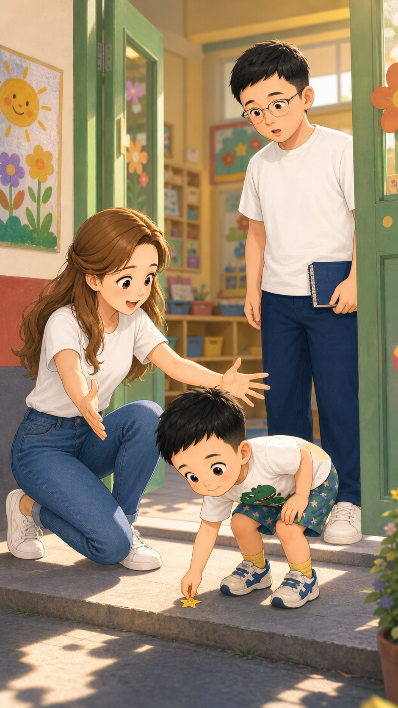
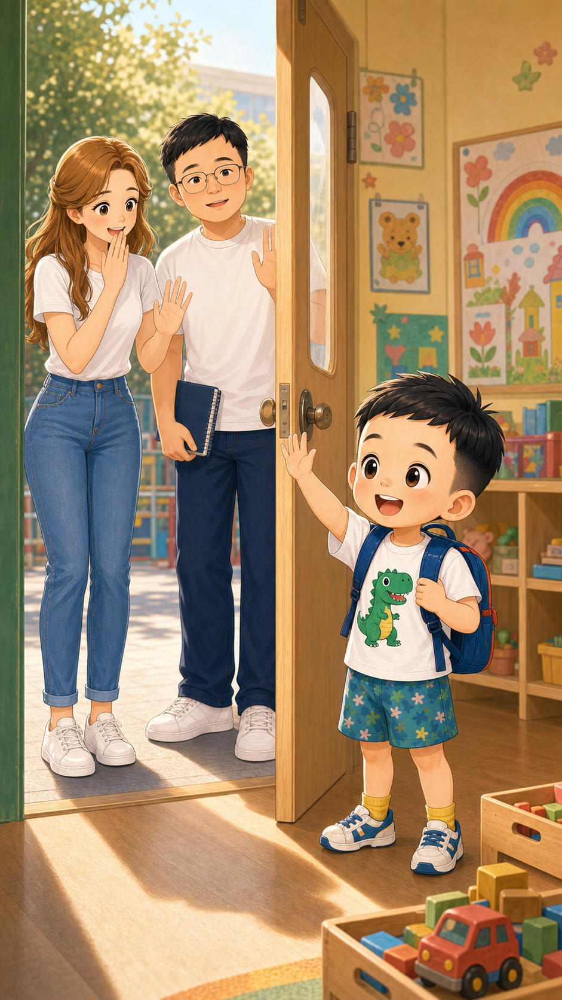

# 宝宝初入幼儿园

## 封面信息

- 标题：宝宝初入幼儿园
- 副标题：第一天上幼儿园，最需要勇气的可能是爸爸妈妈
- 主角：小北斗、婷婷妈妈、北斗爸爸
- 主题：入园第一天、亲子分离、勇气和安全感

## 第 1 页

小北斗背好小书包，开心地跑向幼儿园。

他一边跑，一边唱：“小书包背好啦，幼儿园我来啦，见到老师笑一笑，早上好！”

婷婷妈妈和北斗爸爸跟在后面，笑着笑着，又有一点舍不得。

## 第 2 页

到了幼儿园门口，婷婷妈妈蹲下来，轻轻帮小北斗整理书包带。

她摸摸书包，又看看小北斗，小声说：“要不，妈妈再陪你五分钟？”

小北斗站得直直的，像一个准备出发的小队长。

## 第 3 页

小北斗抬起头，认真地看着妈妈。

“妈妈，你也要上幼儿园吗？”

婷婷妈妈愣了一下，北斗爸爸在旁边差点笑出来。

## 第 4 页

北斗爸爸拿出小本子，清了清嗓子。

“爸爸觉得，可以先开个家庭会议。”

小北斗赶紧摆摆手：“不用开会，我已经是大班预备队了！”

## 第 5 页

小北斗从口袋里拿出小星星贴纸。

“来，一人一个勇气贴纸。”

他把一颗小星星贴到婷婷妈妈身上，又把另一颗贴到北斗爸爸身上。

## 第 6 页

林老师在教室门口弯下腰，温柔地招招手。

“小北斗，早上好。我们一起去看小汽车积木吧！”

小北斗的眼睛一下子亮了起来。

## 第 7 页

小北斗站在门里面，认真地举起小手。

“妈妈爸爸，挥手三下，不能多哦。”

婷婷妈妈和北斗爸爸站在门外，努力笑着挥手。

## 第 8 页

北斗爸爸还是有点放心不下，悄悄靠近门口，想再看一眼。

小北斗马上发现了。

“爸爸，不能趴门缝，会吓到积木。”

婷婷妈妈忍不住笑了。

## 第 9 页

小北斗忽然跑了回来。

婷婷妈妈赶紧张开手：“是不是舍不得妈妈呀？”

小北斗蹲下来，捡起地上的小星星。

“不是，妈妈，你的勇气贴纸掉了。”

## 第 10 页

小北斗站在教室门口，开心地挥挥手。

“你们乖乖上班，下午我来接你们！”

婷婷妈妈和北斗爸爸站在门外，又想笑，又有一点鼻子酸。

原来第一天上幼儿园，勇敢的不只是小朋友，也有爸爸妈妈。

## 亲子共读提示

- 小北斗为什么要给爸爸妈妈贴勇气贴纸？
- 你第一次去新地方时，最想带上什么？
- 如果爸爸妈妈有点舍不得，你会怎么安慰他们？
