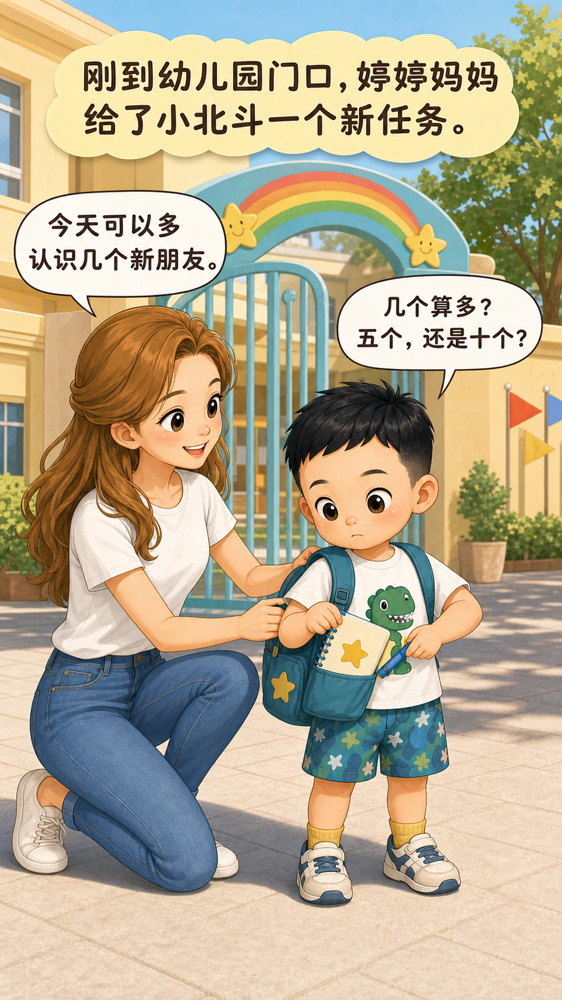
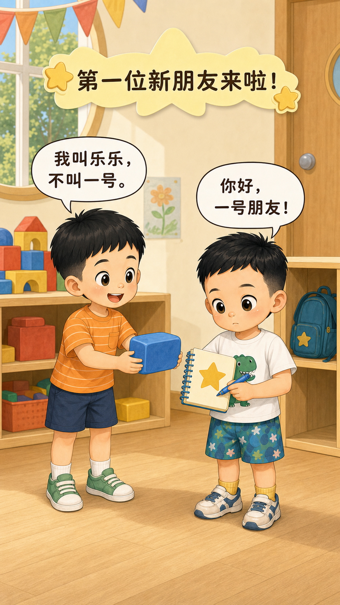
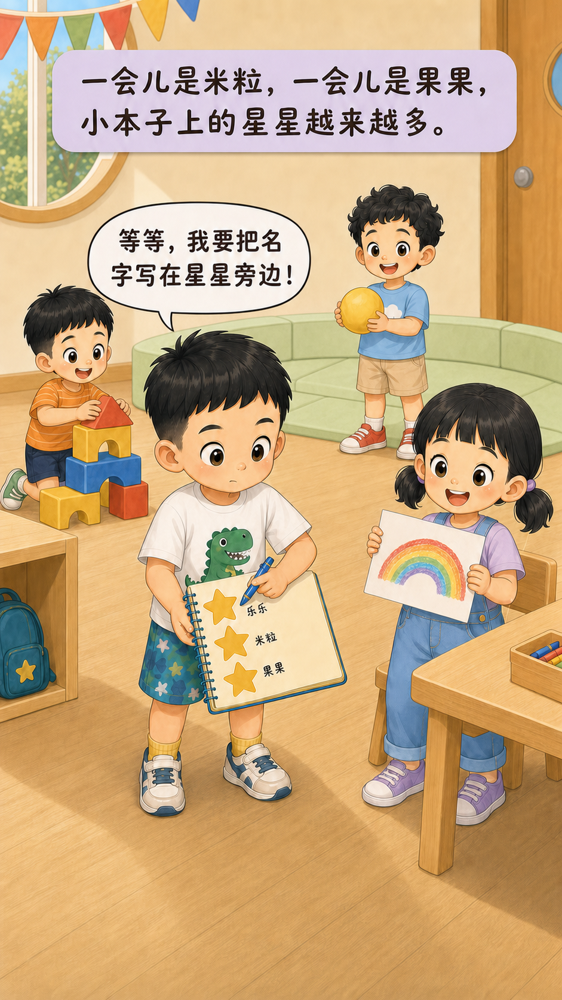
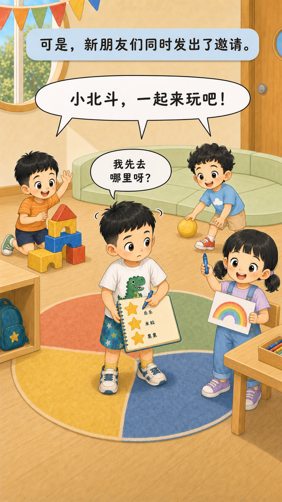
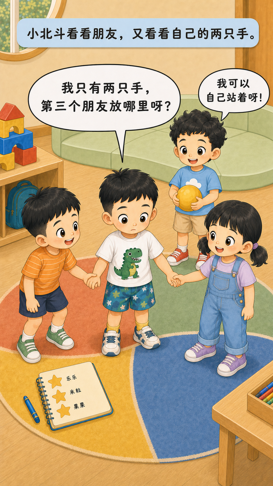
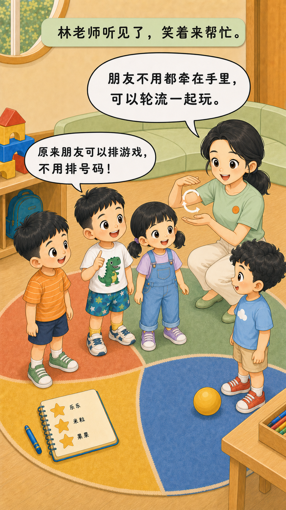
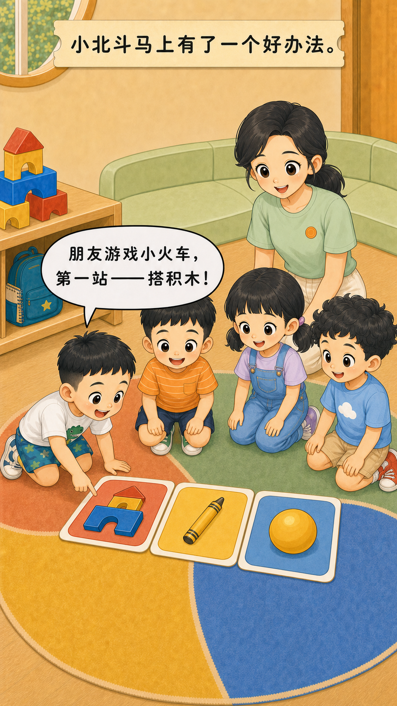
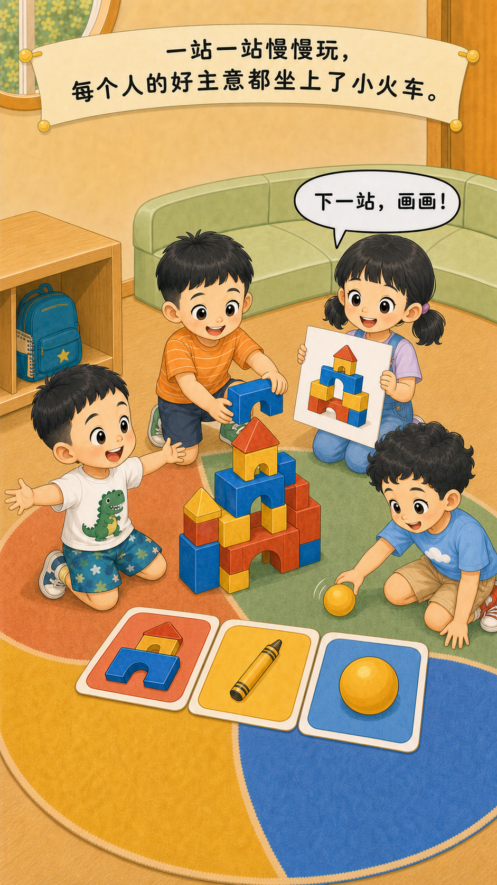
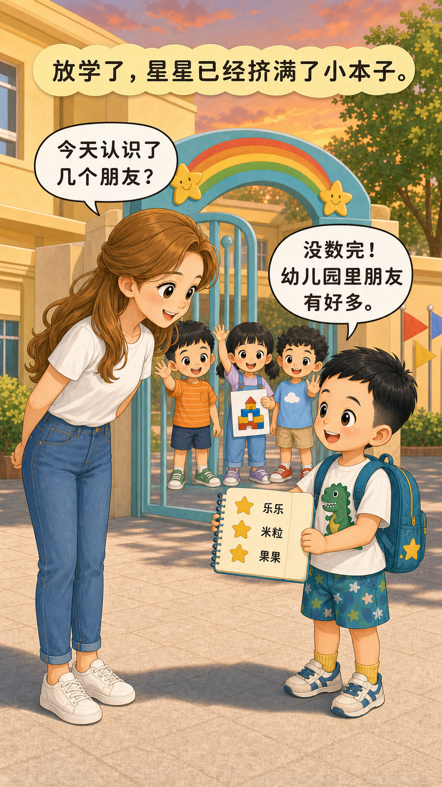
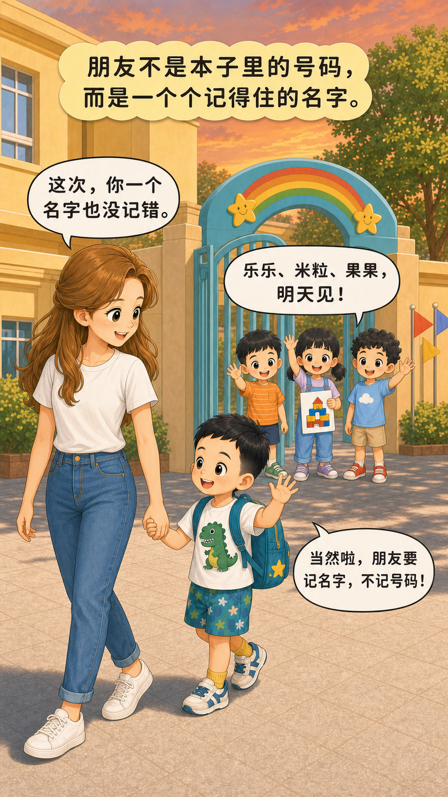

# 幼儿园里朋友有好多

## 封面信息

- 标题：幼儿园里朋友有好多
- 副标题：朋友不是数量，是一个个记得住的名字
- 主角：小北斗、婷婷妈妈、林老师、乐乐、米粒、果果
- 主题：认识新朋友、轮流游戏、记住名字和尊重朋友

## 第 1 页

刚到幼儿园门口，婷婷妈妈给了小北斗一个新任务。

婷婷妈妈：“今天可以多认识几个新朋友。”

小北斗：“几个算多？五个，还是十个？”

## 第 2 页

第一位新朋友来啦！

小北斗：“你好，一号朋友！”

乐乐：“我叫乐乐，不叫一号。”

## 第 3 页

一会儿是米粒，一会儿是果果，小本子上的星星越来越多。

小北斗：“等等，我要把名字写在星星旁边！”

## 第 4 页

可是，新朋友们同时发出了邀请。

乐乐、米粒、果果：“小北斗，一起来玩吧！”

小北斗：“我先去哪里呀？”

## 第 5 页

小北斗看看朋友，又看看自己的两只手。

小北斗：“我只有两只手，第三个朋友放哪里呀？”

果果：“我可以自己站着呀！”

## 第 6 页

林老师听见了，笑着来帮忙。

林老师：“朋友不用都牵在手里，可以轮流一起玩。”

小北斗：“原来朋友可以排游戏，不用排号码！”

## 第 7 页

小北斗马上有了一个好办法。

小北斗：“朋友游戏小火车，第一站——搭积木！”

## 第 8 页

一站一站慢慢玩，每个人的好主意都坐上了小火车。

米粒：“下一站，画画！”

果果：“然后一起滚球！”

## 第 9 页

放学了，星星已经挤满了小本子。

婷婷妈妈：“今天认识了几个朋友？”

小北斗：“没数完！幼儿园里朋友有好多。”

## 第 10 页

朋友不是本子里的号码，而是一个个记得住的名字。

小北斗：“乐乐、米粒、果果，明天见！”

婷婷妈妈：“这次，你一个名字也没记错。”

小北斗：“当然啦，朋友要记名字，不记号码！”

## 亲子共读提示

- 你在幼儿园里记住了哪些朋友的名字？
- 两个朋友同时邀请你时，可以怎么说？
- 你最想和朋友轮流玩什么游戏？
